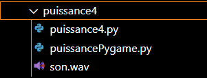

# Home

## Summary
- Presentation
- Prerequisite
- Installation
- Usefull Functions
- Contribution

## Presentation
"**Home**" is a multi player game in object oriented programming (POO) with a graphic interface and using a relational database.
You can play in multi player to some mini games presented in the red house "**Hostel**" :
- Knight castle. 
- Space Ship.
- Puissance 4.
- Pac-Man.
- Tic Tac Toe.
- Snake.

## Prerequisite

- The new windows terminal, just click on [this link](https://www.microsoft.com/fr-fr/p/windows-terminal/9n0dx20hk701#activetab=pivot:overviewtab) to download it from the windows store
- **Python 3.10**
- Install all modules in the file requirements.txt.

## Installation

Just download **all** the folder and launch the main.py file.

## Mini games

In the red house, you have a computer at the right. If you "arrive" on him, a game menu is opening with all mini games created. 

##### Knight Castle

This game is an adventure game on several levels. At each level, the monsters are stronger and it will be harder for you to recover the coins. Be careful, if you lose a level, you go back to the lower level.

##### Space Ship

You’re being invaded by aliens. It’s up to you to destroy them before they destroy your planet.

##### Puissance 4

You all know the classic Power 4 game: you have to line up 4 red or yellow chips horizontally, vertically or diagonally to win.
This game is usually played by two.

##### Pac-Man

In a maze, you must retrieve all the coins without being eaten by the ghosts. You’re the yellow player, and the others are the ghosts. Be careful, each ghost has a specific speed and response.

##### Snake

The little snake feeds on apples. Point it towards them by moving through the arrows on your keyboard. Be careful, if you collide with the frame or if you bite your tail, you have lost.

##### Morbac

The morbac is a morpion. Simply align the crosses or rounds horizontally, vertically or diagonally to win.

## Useful Functions

When you download the folder, you get these files :

### Ressources

In the **_ressources_** folder, you will find several folders and files :
- The *fichiers-tmx* folder which includes the card and home tmx files.
- The *png* folder which includes pngs.
- The *tmx_tsx* folder which includes tmx and tsx files from the house, and the world.
- Font files.
- *png* and *tsx* files in relation to the character, the house and the world.

### Scripts Python

And then, you have different folders and files :
- The *menu* folder that includes the mini-games menu as well as all mini-games.
- The *animation.py* file that initiates the animation of the player according to his movements : right, left, front and back. According to each position, its image changes.
- The *dialog.py* file that initiates the dialog boxes of the PNJs.
- The *entity.py* file that initiates the PNJs and the player (movement, spawn). This file also saves the position if there is a collision.
- The *game.py* file that initiates the game itself.
- The *main.py* file that starts the game.
- The *map.py* file that initiates the map with portals, map (data, relative functions and display). Similarly, collisions with the PNJs and the player are handled with this file, but also in the map. We also load all the data from the tmx file here to display the mao.
- The *player_chat.py* file initiates the chat for players.
- The *var.py* file is a file with variables about the player.

### BDD

In the **_BDD_** folder, we have all the files needed for the database :
- A *Data_joueur.py* file that initiates the player's data (name, email, password).
- A *DBUtil.py* file that allows the connection between the game and the database.
- A file for each game to create a table for them in the database.

#### Knight Castle

In the Knight Casstle file; you have several folders.

First of all, you have all the files related to external data you need :
- the audios,
- sound effects,
- the necessary graphics (decorations, enemies, items, coins, etc.),
- as well as graphs for levels with tmx and csv files.

In this *level* file, you can add graphics if you want to add levels to the game :
- put the tmx files in the level data folder,
- the tsx files in the tileset folder,
- and create a folder with the number of your level with all the csv files inside.

If you want to change the font, put it in the root of the Knight Castle file or it will not be effective.

TO go into the code of the other files in detail :
- The *enemy.py* file corresponds to the code that handles enemies : position, speed, life.
- The *game_data.py* file is a file that includes dictionaries corresponding to the levels. As shown in the picture below, there is the name of the level and each keyword corresponds to a csv path. If you want to add a level, you will need to create a new dictionary in that file with the number of your level and add all the necessary csv files.

- The *game.py* file handles the whole game itself.
- The *level.py* file corresponds to the level of the game : the player's position when logging on the overworld, the differents imports (audios and csv), the display of tiles in groups (terrain, piegepik, objects, coins, enemies, constraints, backgrounds), the player himself (life at 100 pv, 0 coins, display), collisions (enemies and walls), the scroll_x (a bit like pyscroll but here, we follow the player only on the x position), gravity (check if the character is on the ground or not) and check if the player wins or loses.
- The *overwolrd.py* file corresponds to the nodes of the game : display them, animate them and update their lives according to he damage caused by the player.
- The *particles.py* file is the code that handles particles when the player jumps, falls or explodes enemies.
- The *piegepik.py* file corresponds to the code that handles the traps : position and speed.
- The *player.py* file corresponds to the code that handles all the details of the character himself : the particles, the movements, the positions, the life, the damage he deals or receives, and the animation of the character.
- The *setting.py* file corresponds to the variables needed for the display : the number of tiles in height, the width of the tiles and the width of the screen (number of tiles by the width of the tiles). You can change this data if you wish.
- The *support.py* file corresponds to how the screen is cut out and how the computer should read it : to be simpler, it is how the computer should read and display the files for a graphic rendering.
- The *tiles.py* file corresponds to the explanation of what a tile is and how to use them : static or animated. It also includes animating coins that rotate on themselves.
- The *ui.py* file corresponds to the display and use of screen display in addition : life bar, coins, etc.

#### Spaceship

Now, let's move on to the game Spaceship.

In the assets folders, you have :
- The *icons* folder which are all the icons at the beginning.
- The *sounds* folder which are all the sounds included in the game.
- Images in PNG.
- The handwriting font.

Then, we have : 
- The *enemy.py* file initiates all the values of each enemy : the max life, the attack points, the PNG's, the size (can be changed), the position (in x only because in y, you have a randint so that they appear in different places), the damage (with the xp removed and the noises), the life bar and the moves with a function named forward which allows to make an oscillation system.
- The *game.py* file handles start, game over and enemy response.
- The *player.py* file handles the player itself : life, attack points (can be changed), speed (can be changed), starting position, xp max (can be changed), getting another level when xp max is reached, xp wins, damage (if xp = 0, it is the end of the party), projectiles and movements.
- The *projectile.py* file initiates movements on projectiles.
- The *spaceship_main.py* file that starts with the start function, and the import of all necessary paths (icons, background, level up, banners, musics, position). Then, we have the loop of the game with the use of either the keys of the keyboard or the joystick of a controller (with the pygame function JOYHATMOTION). We also manage the speed of the projectiles with velocity (chich can be increased or decreased), the collisions (damage and enemy disappearing to get oof the screen (you can change this if you want the enemy to disappear sooner or later.))

#### Puissance 4

In the Puissance 4 folder, you have 3 files :
- The *puissance4.py* file that creates the game matrix to display the board. The conditions are also checked to find out if the game is winning or null (vertical, horizontal, and diagonale right and left position).
- The *puissance4Pygame.py* file which will first display the board and the tokens. Then, there is the loop of the game so that the chip moves with the movement of the mouse and gets intos the board. On the next player's turn, the colour of the chip changes (betweeen red or yellow (you can change them if you wish)).
- An audio file.

#### Pac-Man

In the PacMan folder, you will find :
- A *song* folder with all the music of the game.
- An *app_class.py* file that initiates the walls, the enemies, the grid, the rooms, as well as all the functions related to the game (start, game over, restart, score).
- An *enemy_class.py* file that initiates enemies (color, position, speed, path, collisions). You can change their speed in this file because it corresponds to a personnality unique to each enemy : speedy, scared, slow or random.
- The *main.py* file that launch the game.
- Two images : the background for the intro and the maze.
- A *player_class.py* file that initiates the player with his positio, speed, moves, action to be performed when he collides with coins (eating them score increases), and collisions with walls.
- A *settings.py* file that gathers details of colors and scree sizes.
- A *walls.txt file* that corresponds to the text file that allows us to create the labyrinth.

#### The Snake

For the Snake game, we have two images : *head_snake* which corresponds to the head of the snake, and *snake-game* which is the image in the game menu.
In the *game.py* file, the snake's position and speed are first initiated (you can change it if you want). For the position of the apple, we use a random so that it appears randomly. Then, we initiate the keyboard keys so that with each movement of the snake, its position changes. We create a condition for collisions with the walls and if he eats his tail. And another conditon that increases the score when he eats an apple and his body lengthens.
In the *main.py* file, we launch the game.

#### The Morbac

For the minigame of the moprion, you can't change it. 
In the *background.py* file, we initiate the grid and the display of crosses and circles, and set the value at None.
In the *game.py file*, we start the game, create conditions accroding to how crosses and circles are aligned to find out chether the player has won or not (horizontally, vertically, and diagonally), and take care of the restart.
In the *main.py* file, we launch the game.

## Contribution

[@Plessixdavid](https://github.com/Plessixdavid) [@Lezard91](https://github.com/Lezard91) [@jorjormanie](https://github.com/jorjormanie) [@theyadev](https://github.com/theyadev) [@petite-souris](https://github.com/petite-souris)